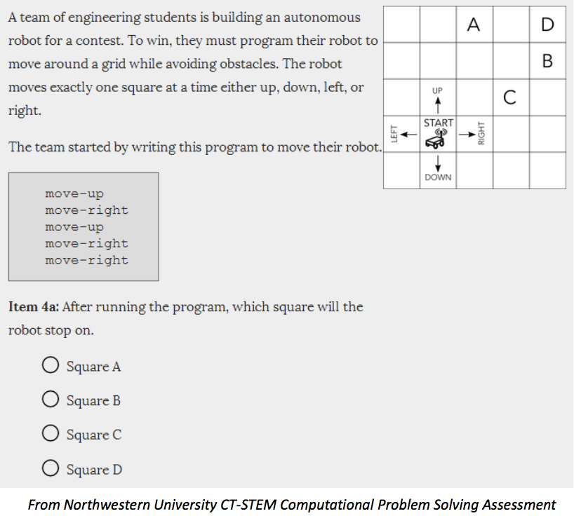
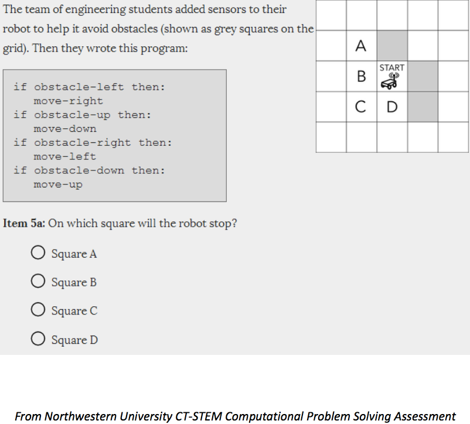

<!--
$theme: gaia
template: invert
footer: CSCI 1380 - 06
-->

# Computer Science I
#### CSCI 1380 - 06 

TR 9:25 am - 10:40 am
 
 
 
### http://bit.ly/1380abcde

---

# JJ Lumagbas

jedaiah.lumagbas@utrgv.edu

---

# Peer-instruction

### Think - Pair - Share

---

Me:

#### A. Not from around here
#### B. Have a BS and Masters
#### C. Currently working on PhD
#### D. Worked as a programmer for 4 years
#### E. Taught at university-level since 2008

---

Me:

#### A. Not from around here
#### B. Have a BS and Masters
#### ~~C. Currently working on PhD~~
#### D. Worked as a programmer for 4 years
#### E. Taught at university-level since 2008

---

Me:

#### A. Freedived to 25ft (no scuba gear!)
#### B. Went skydiving with wife when son was 10mos old
#### C. Worked as a barista in Melbourne
#### D. Ate crickets and silkworms at a street stall in Cambodia
#### E. Had eye poked repeatedly with a needle, not by accident

---

How much programming experience do you have?

#### A. None
#### B. 3 months or less
#### C. 6 months or less
#### D. 1 year or less
#### E. More than a year

---

What's an example of a computer application that's interesting to you?

Complete the sentence: It would be cool if at the end of this course, I could...

---

# Key themes

- Programmability
- Automation
- Abstraction
- Computational thinking

---

# 

---

# 

---

# 

---

# Automation: Programs

- Arbitrary
- Unambiguous
- Appropriate levels of abstraction

---

# Key themes

- Programmability
- Automation
- Abstraction
- Computational thinking

---

# Computers vs Humans

Few operations (but very fast)

vs

Thinking abstractly

---

# Syllabus highlights

### http://bit.ly/1380-6

---

# Reading for next meeting

https://htdp.org/2018-01-06/Book/part_prologue.html

Sections:

- Prologue: How to Program
- Arithmetic and Arithmetic

---

# Photo